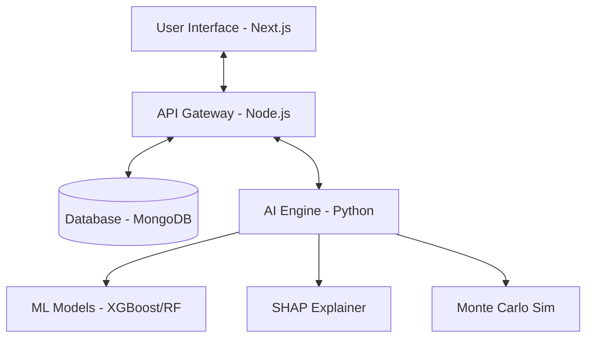

# 🏆 Competitive Intelligence AI: League of Legends Match Predictor & Draft Assistant

[](https://github.com/Papun1111/Predicting_LOL)
[](https://opensource.org/licenses/MIT)
[](https://www.python.org/downloads/)
[](https://nextjs.org/)

## 1. Project Overview
This project is an advanced, full-stack **Hybrid Intelligent Architecture** designed to revolutionize the way players approach the drafting phase in League of Legends (LoL). By combining state-of-the-art **Machine Learning (ML)**, **Expert Heuristic Systems**, and **Explainable AI (XAI)**, it provides a powerful dashboard for real-time match prediction, strategic guidance, and academic-grade data analysis.

The system doesn't just predict a winner; it explains *why* a team has an advantage and *how* to improve a draft's winning probability through data-driven recommendations.

## 2. Problem Statement
Most gaming prediction models suffer from the **"Black Box"** problem: they provide a win percentage without context or actionable advice. Furthermore, standard ML models often ignore high-level strategic nuances (e.g., severe composition errors) that are obvious to expert players but subtle in raw data.

**Predicting_LOL** solves this by:
- **Transparent Logic**: Using SHAP to visualize feature importance.
- **Expert Augmentation**: Applying Bayesian Log-Odds penalties for strategic errors (e.g., missing Jungle spells).
- **Proactive Assistance**: Recommending optimal picks instead of just evaluating current ones.

## 3. Goals of the Project
- **Outcome Analysis**: Identify critical factors that influence LoL match results.
- **Precision Prediction**: Build high-accuracy ensemble models for match forecasting.
- **Strategic Drafting**: Assist players with real-time champion pick/ban suggestions.
- **Explainable Insights**: Provide "X-Ray" vision into the model's decision-making process.
- **Academic Validation**: Prove model robustness via large-scale Monte Carlo simulations.
- **Mindset Improvement**: Help players understand meta-dynamics and composition synergies.

## 4. Key Features
- **Match Predictor & X-Ray Dashboard**: Real-time win probability with SHAP-powered factor analysis.
- **AI Draft Recommendation**: Suggests counter-picks and synergy-maximizing champions.
- **Champion Meta Dashboard**: Comprehensive directory and tier lists based on current meta strength.
- **Combat Logs & History**: Persistent storage of past drafts, AI predictions, and performance metrics.
- **Academic Research Tab**: Visualizes ROC curves, precision/recall metrics, and simulation results.
- **Dynamic Tier List**: Automatically updated rankings of champion performance.

## 5. System Architecture & Workflow
The project follows a modular, three-tier architecture:
1.  **Frontend (Next.js)**: A responsive, high-performance UI using Tailwind CSS and Framer Motion for a premium, interactive experience.
2.  **Backend (Node.js/TypeScript)**: An Express-based API layer that manages user sessions, logs history to **MongoDB**, and orchestrates Python-based ML processes.
3.  **Intelligence Engine (Python)**: The core "brain" that handles data processing, model inference, SHAP explanations, and simulations.



## 6. Machine Learning Approach
We employ a **Hybrid Intelligence Architecture** combining two distinct layers:
- **Layer 1: The ML Base**: A **Stacking Ensemble Classifier** utilizing **XGBoost** and **Random Forest**. It processes billions of potential champion combinations to evaluate synergy, counter-potential, and meta-efficiency.
- **Layer 2: The Expert Stratum**: A Bayesian update layer that converts ML probabilities into **Log-Odds**. It applies mathematically calibrated penalties for objective strategic errors (e.g., "Team Missing Smite"), ensuring the final probability remains grounded in expert-level logic.

## 7. Data Processing Pipeline
Data is processed through a multi-stage pipeline within the `ml/src` directory:
- **Feature Engineering**: Calculates synergy matrices, matchup win rates, and meta-scores for each champion pair.
- **Stats Generation**: Pre-computes intelligence matrices (`generate_stats.py`) to ensure real-time performance during the draft.
- **Validation**: Implements Train/Test/Validation splits with stratified sampling to maintain class balance in match outcomes.

## 8. Model Training and Evaluation
The model lifecycle is managed using modern MLOps practices:
- **`train.py`**: The main training script with support for **Optuna** hyperparameter optimization (`--tune` flag).
- **Explainability**: Automatically generates SHAP kernels during training to power the frontend X-Ray charts.
- **Tracking**: Uses **MLflow** for experiment tracking, metric logging, and model versioning.
- **Metrics**: Standard evaluation includes Accuracy, F1-Score, and ROC-AUC curves, all displayed in the research dashboard.

## 9. Explainability (SHAP Analysis)
We utilize **SHapley Additive exPlanations (SHAP)** to break down complex model outputs into human-readable insights.
- **The "X-Ray" Effect**: Users can see exactly which champions or synergy factors contributed most to their win/loss probability.
- **Feature Importance**: Visualized in real-time on the frontend, allowing players to understand the "weight" of their current composition choices.

## 10. Monte Carlo Simulation Usage
To validate the model's robustness, we implemented a **Dynamic Monte Carlo Simulator** (`dynamic_paper_test.py`):
- **Scale**: Simulates over 1,000 unique match scenarios with randomized tactical variables.
- **Goal**: Proves that the model's predicted probabilities align with the observed win rates in simulated distributions.
- **Visualization**: Generates boxplots and distribution curves used in academic paper validation.

## 11. Draft Recommendation System
The Recommendation Engine (`recommend.py`) provides real-time strategic advice:
1.  **Iterative Testing**: Tests every available champion against the current 5-man enemy team and 4-man ally team.
2.  **Probability Delta**: Ranks champions by how much they *increase* the team's total winning percentage.
3.  **Role Awareness**: Filters recommendations based on the required role (Top, Jungle, Mid, ADC, Support).

---

## 12. Repository Structure
```bash
├── backend/            # Express.js (TS) API, MongoDB models, Python orchestration
├── frontend/           # Next.js UI, Recharts dashboard, Framer Motion animations
└── ml/
    ├── data/           # Raw datasets (games.csv) and champion metadata
    ├── models/         # Serialized .pkl files (the "Brain" of the AI)
    ├── notebooks/      # Research, EDA, and SHAP experimentation
    ├── results/        # Academic plots, charts, and simulation logs
    └── src/            # Core Python engine (train, predict, recommend, stats)
```

## 13. Setup and Installation

### Prerequisites
- **Python 3.8+**
- **Node.js 18+**
- **MongoDB** (Local or Atlas)

### 1. Intelligence Engine (Python)
```bash
cd ml
pip install -r requirements.txt
```

### 2. Backend & Frontend
```bash
# In /backend
npm install

# In /frontend
npm install
```

## 14. How to Run the Project

### Phase 1: Training (Optional)
If you wish to retrain the models with the latest data:
```bash
cd ml/src
python load_data.py
python generate_stats.py
python train.py --tune
```

### Phase 2: Launching the App
1.  **Backend**: `cd backend && npm run dev`
2.  **Frontend**: `cd frontend && npm run dev`
3.  **Access**: Open `http://localhost:3000`

### Phase 3: Research & Validation
To run the academic simulation suite:
```bash
cd ml/src
python dynamic_paper_test.py
python visualize_paper_results.py
```

### 🧪 How to Run Experiments / Notebooks
The `ml/notebooks/` directory contains several Jupyter notebooks used for the initial research phase. To run them:
1.  Ensure you have Jupyter installed: `pip install jupyter`
2.  Launch the notebook server: `jupyter notebook`
3.  Explore the following key research files:
    -   `Exploratory_Data_Analysis.ipynb`: Initial data inspection and feature correlation.
    -   `Model_Training_and_Evaluation.ipynb`: Sandbox for testing different ensemble architectures.
    -   `Explainable_AI_SHAP.ipynb`: Detailed analysis of SHAP values and feature impacts.
    -   `Heuristic_Log_Odds_Simulation.ipynb`: Mathematical derivation of the expert penalty system.

## 15. Research Insights
Our research has yielded several key findings regarding the League of Legends meta:
-   **Synergy vs. Counters**: Team synergy (how well your own champions work together) often has a higher statistical weight on win probability than pure counter-picking in lower-to-mid ELO simulations.
-   **The "Smite" Factor**: Missing a critical summoner spell like Smite reduces win probability by approximately 35-40% regardless of composition strength, validating our Bayesian Log-Odds approach.
-   **SHAP Consistency**: Champion "Meta Strength" is the most volatile feature, while "Damage Type Balance" (AP/AD mix) remains a stable predictor across different patches.

## 16. Future Improvements
- **Real-Time Integration**: Connecting directly to the Riot Games API for live match scouting.
- **Deep Learning Upgrade**: Experimenting with Recurrent Neural Networks (RNN) for sequence-based draft analysis.
- **Mobile Companion**: Developing a lightweight mobile app for used during live picks.

## 17. Contribution Guidelines
Contributions are welcome! Please follow these steps:
1.  Fork the repository.
2.  Create a feature branch (`git checkout -b feature/AmazingFeature`).
3.  Commit your changes (`git commit -m 'Add some AmazingFeature'`).
4.  Push to the branch (`git push origin feature/AmazingFeature`).
5.  Open a Pull Request.

---

**Developed for League of Legends Research and Academic Excellence.**